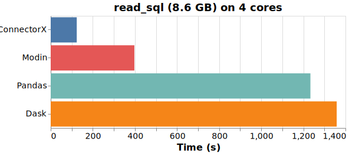
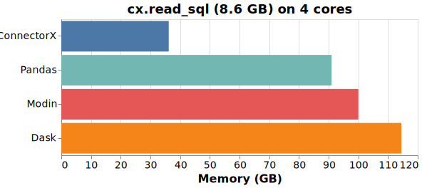

# Connector Agent [![status][ci_badge]][ci_page] [![docs][docs_badge]][docs_page]

[ci_badge]: https://github.com/sfu-db/connector-agent/workflows/ci/badge.svg
[ci_page]: https://github.com/sfu-db/connector-agent/actions

[docs_badge]: https://github.com/sfu-db/connector-agent/workflows/docs/badge.svg
[docs_page]: https://sfu-db.github.io/connector-agent/connector_agent/

Load data from  to , the fastest way.


Connector Agent enables you to load data from databases into Python in the fastest and most memory efficient way.

What you need is one line of code:
```python
import connectorx as cx

cx.read_sql("postgres://localhost", "SELECT * FROM lineitem")
```

Optionally, you can accelerate the data loading using parallelism by specifying a partition column.
```python
import connectorx as cx

cx.read_sql("postgres://localhost", "SELECT * FROM lineitem", partition_on="l_orderkey", partition_num=10)
```

# Installation

```bash
pip install connectorx
```
# Performance

We compared different solutions in Python that provides the `read_sql` function, by loading a 10x TPC-H lineitem table (8.6GB) from Postgres into a DataFrame, with 4 cores parallelism. 

## Time chart, lower is better.
<p align="center"></p>

## Memory consumption chart, lower is better.
<p align="center"></p>


In conclusion, ConnectorX uses up to 3x less memory and 11x less time.

## How does Connector Agent achieve a lightening speed while keeps the memory footprint low?

We observe that existing solutions more or less do data copy multiple times when downloading the data.
Additionally, implementing a data intensive application in Python brings additional cost.

Connector Agent is written in Rust and follows "zero-copy" principle.
This allows it to make full use of the CPU by becoming cache and branch predictor friendly. Moreover, the architecture of Connector Agent ensures the data will be copied exactly once, directly from the source to the destination.

# Implementation status

* Sources
  - [x] Postgres
  - [ ] Mysql
  - [ ] Redshift
  - [ ] Sqlite
  - [ ] Other databases
  - [ ] Other sources like S3
* Destinations
  - [x] Pandas DataFrame
  - [ ] Dask DataFrame
  - [ ] Modin DataFrame
  - [ ] PyArrow
* New features
  - [ ] Local data cache
  - [ ] Database aware partition scheme
